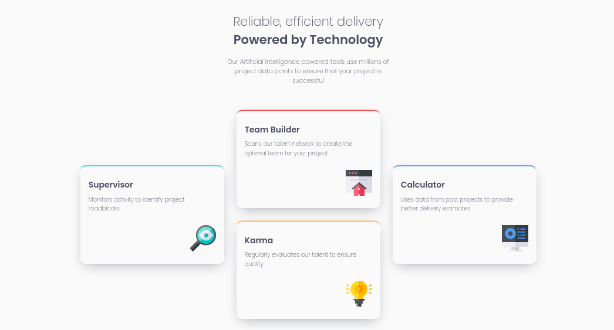

# Frontend Mentor - Four card feature section solution

This is a solution to the [Four card feature section challenge on Frontend Mentor](https://www.frontendmentor.io/challenges/four-card-feature-section-weK1eFYK). Frontend Mentor challenges help you improve your coding skills by building realistic projects.

## Table of contents

- [Overview](#overview)
  - [The challenge](#the-challenge)
  - [Screenshot](#screenshot)
  - [Links](#links)
- [My process](#my-process)
  - [Built with](#built-with)
  - [What I learned](#what-i-learned)
  - [Continued development](#continued-development)
- [Author](#author)

## Overview

### The challenge

Users should be able to:

- View the optimal layout for the section depending on their device's screen size

### Screenshot

### Links

- Solution URL: [Frontend Mentor Solution](https://www.frontendmentor.io/solutions/four-card-feature-section-solution-njoZnCiTo8)
- Live Site URL: [Four card feature section](https://axldev96.github.io/four_card_feature_section/)

## My process

### Built with

- Semantic HTML5 markup
- CSS custom properties
- Flexbox
- CSS Grid
- Mobile-first workflow

### What I learned

I really made progress on this project using media queries and CSS Grid to make the website responsive.

### Continued development

I would like to continue my progress on CSS with media queries and responsive layout with grid and flexbox.

## Author

- Frontend Mentor - [@axldev96](https://www.frontendmentor.io/profile/axldev96)
- Twitter - [@axldev96](https://twitter.com/axldev96)
